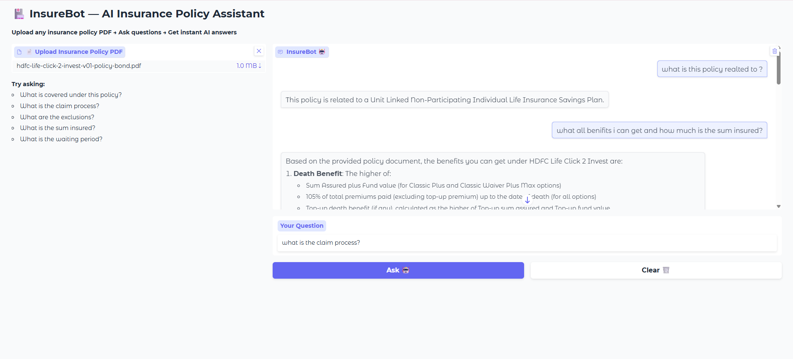
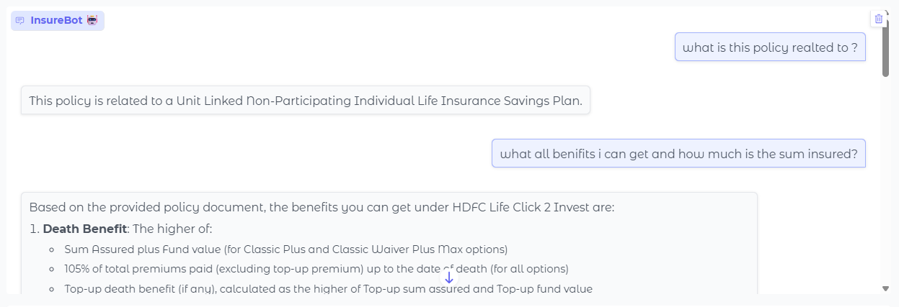
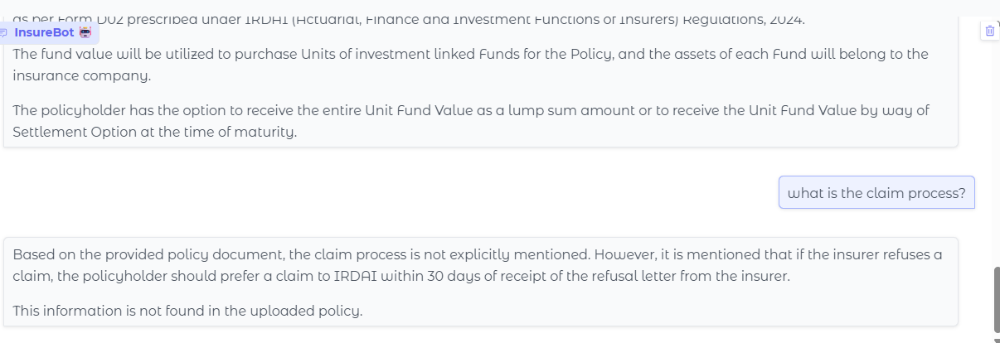

# 🏥 InsureBot — AI Insurance Policy Assistant

Upload any insurance policy PDF and ask questions in plain English.
Get instant AI-powered answers about coverage, claims, exclusions, and more.


![InsureBot Demo] 





---

## 🧠 How It Works

1. Upload a PDF insurance policy
2. PDF is split into chunks and embedded using HuggingFace
3. Your question retrieves the most relevant chunks (RAG)
4. Groq LLaMA 3.1 answers based on the policy content

---

## 🛠️ Tech Stack

| Tool | Purpose |
|------|---------|
| LangChain | RAG pipeline orchestration |
| Groq (LLaMA 3.1) | LLM for answering questions |
| FAISS | Vector similarity search |
| HuggingFace Embeddings | Convert text to vectors |
| Gradio | Web UI |
| PyPDF | PDF parsing |

---

## 🚀 Run Locally

```bash
git clone https://github.com/adithyaraghav/insurebot
cd insurebot
pip install -r requirements.txt
export GROQ_API_KEY="your-key-here"
python app.py
💡 Use Cases
Understand what your health policy covers
Check claim eligibility instantly
Find exclusions and waiting periods
Compare policy terms easily
📸 Demo
Upload any insurance PDF → Type your question → Get instant answer!
